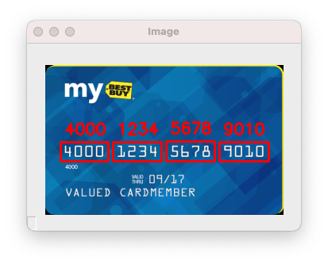

# credit-card-ocr



```
# Usage
python3 ocr_template_match.py --reference ocr_a_reference.png --image images/credit_card_01.png

# Output
Credit Card Type: Visa
Credit Card #: 4000123456789010
```

Source: https://www.pyimagesearch.com/2017/07/17/credit-card-ocr-with-opencv-and-python/
